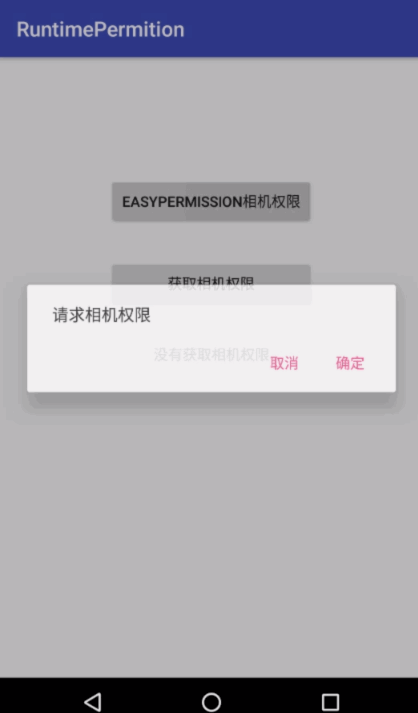
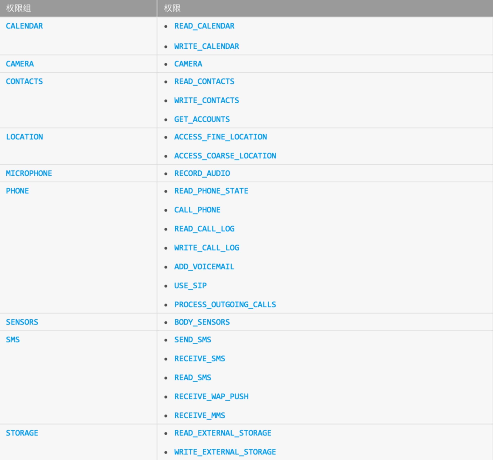

# RuntimePermition
Android 6.0 application runtime permisstion, some demo


targetSdkVersion 是 23  的设备会需要使用运行时权限授权 

**对于传统的方式**
```java
if (ContextCompat.checkSelfPermission(this, Manifest.permission.CAMERA)!= PackageManager.PERMISSION_GRANTED) {
      // 第一次请求权限时，用户如果拒绝，下一次请求shouldShowRequestPermissionRationale()返回true
      // 向用户解释为什么需要这个权限
      if (ActivityCompat.shouldShowRequestPermissionRationale(this, Manifest.permission.CAMERA)) {
        new AlertDialog.Builder(this)
            .setMessage("申请相机权限")
            .setPositiveButton("确定", new DialogInterface.OnClickListener() {
              @Override
              public void onClick(DialogInterface dialog, int which) {
                ActivityCompat.requestPermissions(MainActivity.this,new String[]{Manifest.permission.CAMERA},1);
              }
            }).show();

      }else {
        //申请相机权限
        ActivityCompat.requestPermissions(MainActivity.this,new String[]{Manifest.permission.CAMERA,},1);
      }

    }
```

